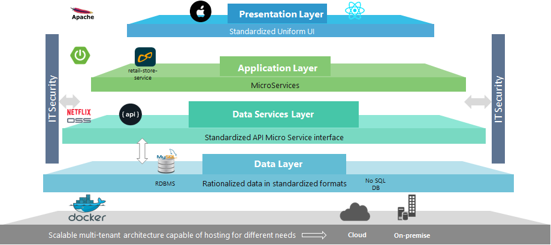

# Online Retail Application

This application was built for internal training and evaluation purposes. This Online retail application was developed from atsea sample shop application from docker. 

## Architecture

The application is built on `ReactsJS` user interface, `Spring Boot` based micorservices layer to serve the data demands, `Netflix OSS` based API layer and `MySQL` database to hold the retail store data.



## Deployment

The section describses the step by step instruction to host the application in targer infrastrcture (On-Premise or cloud)

`Prerequisites`

1. Apache web server
2. JDK 1.8+
3. MySQL 5+
4. Docker v17+

### Apache Web Server Installation for Windows

Download the appropriate installer / zip archive from link https://directory.apache.org/studio/download/download-windows.html and follow the setup instructions

### Apache Web Server Configuration

1. Modify direcotry configuration in apache config file and change "<Path to UI module>/training/online-retail-ui" to corresponding location of ui build. Refer this link for windows https://thecodecentral.com/2007/03/24/setting-up-your-own-web-server-with-apache-http-server-php-and-mysql-on-a-windows-machine#Changing_Document_Root

		```
		Alias /training/retail <Path to IU Module>/training/online-retail-ui

		<Directory /apps/training/online-retail>

			## No MultiViews
			AddOutputFilterByType DEFLATE text/html
			DirectoryIndex index.html
			Options FollowSymLinks

			Require all granted

		</Directory>
		```
2. Setup reverse proxy for microservice layer. Add below configuration to apache config file. Change the "pacelab.cognizant.com" to appropriate domain or ip in the below config.
		```
		ProxyPass /retail  http://pacelab.cognizant.com:10001/retail
		ProxyPassReverse /retail  http://pacelab.cognizant.com:10001/retail
		```
3. Restart Apache instance

### UI Deployment

1. Production build is available in release branch "https://code.cognizant.com/cde-pace-lab/OnlineRetailStore/tree/release/deployment/ui"
2. Copy all contents of ui to directory (<Path to UI Module>/training/online-retail-ui)


### Microservice Deployment

1. Create a directory for `retail-store-service` (<Path to UI Module>/training/retail-store-service)
2. Copy all files under "https://code.cognizant.com/cde-pace-lab/OnlineRetailStore/tree/release/deployment/retail-store-service" to newly created directory "<Path to UI Module>/training/retail-store-service"
3. Edit config/application.properties for correct MySQL database connection information
4. Use the below bat scripts to start/stop the service
	* To Start the application service by simply type the following command and the logs will be appending under /logs directory
		```
		./startup.bat
		```
	* To stop the application service, simply type the following command
		```
		./shutdown.bat
		```

Note: This service layer requires java jdk 1.8+. 
		
### Database layer

### Installation Steps for Windows

Step 1: Download MySQL Installer from https://dev.mysql.com/downloads/installer/ and execute it.

Step 2: Choose the appropriate Setup Type for your system. Typically you will choose Developer Default to install MySQL server and other MySQL tools related to MySQL development, helpful tools like MySQL Workbench. Or, choose the Custom setup type to manually select your desired MySQL products.

Step 3: Complete the installation process by following the instructions. This will install several MySQL products and start the MySQL server.

### Data Setup 

Create the database schema and tables by running the queries under `online-retail-service/MySQLQueries.sql`. This will also populate the data requirerd to run the application.

### Data Validation

Check the inserted data by running the query "select * from product"

## The Online Retails Shop

The URL for the content is `http://<application domain>/training/retail`

## Load generation

A Jmeter script has been created to generate load into the deployed application. You can find the script under scripts directory